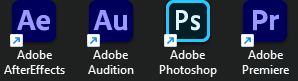

<h2 align="center"> ✨ Remove_Shortcut_Icon ✨ </h2>

```zsh
> A very simple one-time program to remove shortcut icons ⭐
```

```zsh
   __                                   __ _                _             _        _____                
  /__\ ___ _ __ ___   _____   _____    / _\ |__   ___  _ __| |_ ___ _   _| |_      \_   \___ ___  _ __  
 / \/// _ \ '_ ` _ \ / _ \ \ / / _ \   \ \| '_ \ / _ \| '__| __/ __| | | | __|      / /\/ __/ _ \| '_ \ 
/ _  \  __/ | | | | | (_) \ V /  __/   _\ \ | | | (_) | |  | || (__| |_| | |_    /\/ /_| (_| (_) | | | |
\/ \_/\___|_| |_| |_|\___/ \_/ \___|___\__/_| |_|\___/|_|   \__\___|\__,_|\__|___\____/ \___\___/|_| |_|
             
```




```zsh
> ⭐ Very simple one-time ⭐
```

```zsh
> Please run as administrator ❤️

> Because it s a one-time action I didn t include recovery code ⭐

> To revert  please manually delete the key named 29 under the registry path ⭐

> HKEY_LOCAL_MACHINE\SOFTWARE\Microsoft\Windows\CurrentVersion\Explorer\Shell Icons <
```

<h2 align="center"> 🧡 END 🧡 </h2>
